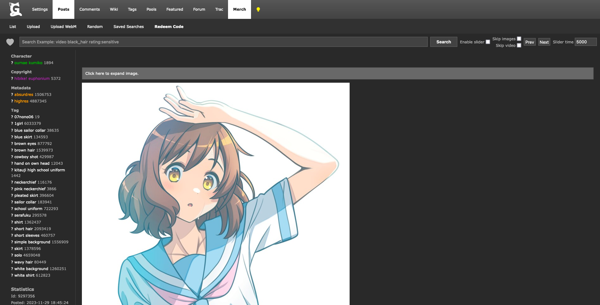
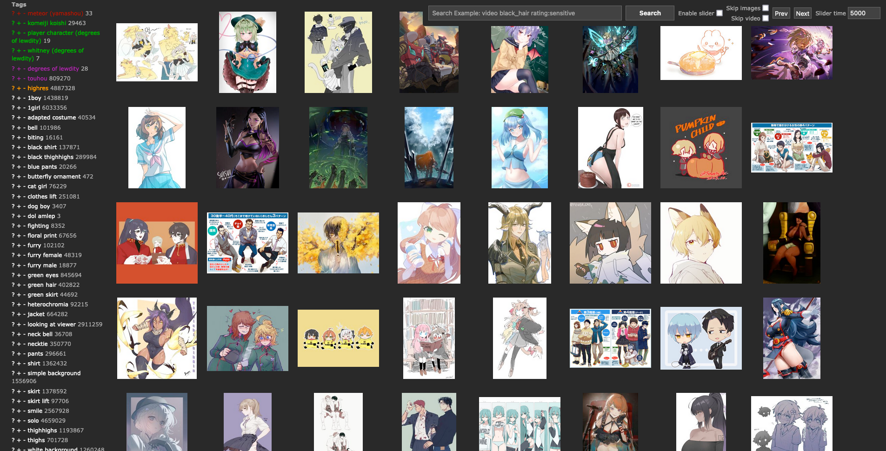
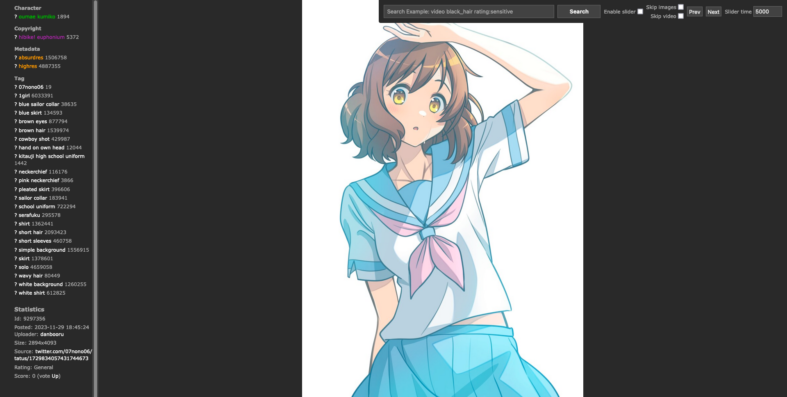

# [Gelbooru](https://gelbooru.com) Layout Upgrade
### Introduction
I was dissatisfied with Gelbooru lacking a slider option, so I created one. Additionally, I added some styles to achieve a minimalistic look.

### Two Sets of Styles
This repository contains two sets of styles: 'Minimal' and 'Minimalistic,' along with a script to enable them.

### Pros
1. Ability to skip video content.
2. Ability to skip image content.
3. Configurable slider delay.
4. 'Minimalistic' style hides ads.

### Cons
1. Heavy dependency on Gelbooru's exposed methods.
2. May occasionally break. 🫣
3. Mix of jQuery and plain JavaScript methods.

### Prerequisites
* Tampermonkey to run the script:
    - [Chrome](https://chromewebstore.google.com/detail/dhdgffkkebhmkfjojejmpbldmpobfkfo)
    - [Mozilla](https://addons.mozilla.org/en-US/firefox/addon/tampermonkey/)
* Stylus to apply additional styles:
    - [Chrome](https://chromewebstore.google.com/detail/stylus/clngdbkpkpeebahjckkjfobafhncgmne)
    - [Mozilla](https://addons.mozilla.org/en-US/firefox/addon/styl-us/)

### Visuals
#### Minimal Styles
##### Gallery View

##### Image View

#### Minimalistic Styles
##### Gallery View

##### Image View

